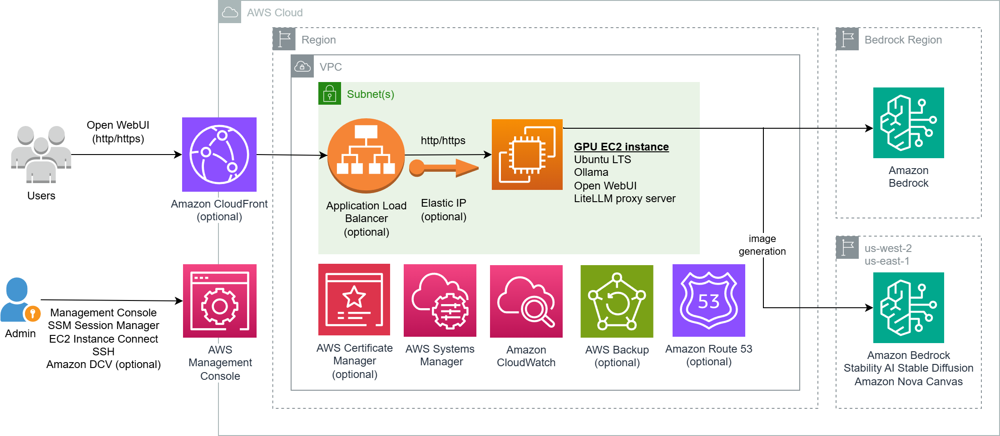

## Ollama-Server

[Ollama](https://ollama.com/) allows users to run open-source [large language models (LLMs)](https://aws.amazon.com/what-is/large-language-model/), offering a streamlined command line experience for interacting with and experimenting with these models. [Open WebUI](https://openwebui.com/) is an extensible, feature-rich, and user-friendly web interface to Ollama.  For best performance, a [GPU](https://github.com/ollama/ollama/blob/main/docs/gpu.md) is required.


This repo provides a [AWS CloudFormation](https://aws.amazon.com/cloudformation/) template to provision [NVIDIA GPU EC2 instance](https://aws.amazon.com/ec2/instance-types/#Accelerated_Computing) with Ollama and Open WebUI, and include access to [Amazon Bedrock](https://aws.amazon.com/bedrock/) foundation models (FMs). Solution can be deployed as a website for LLM interaction (through Open WebUI) or for application development.


## Architecture Diagram



## Overview of Features
Template provides the following features
- NVIDIA GPU EC2 instance. Supported instance types include
  - x86_64: [G4dn](https://aws.amazon.com/ec2/instance-types/g4/#Product_Details), [G5](https://aws.amazon.com/ec2/instance-types/g5/), [G6](https://aws.amazon.com/ec2/instance-types/g6/#Product_details), [Gr6](https://aws.amazon.com/ec2/instance-types/g6/#Product_details), [G6e](https://aws.amazon.com/ec2/instance-types/g6e/), [P4d](https://aws.amazon.com/ec2/instance-types/p4/#Product_details), [P4de](https://aws.amazon.com/ec2/instance-types/p4/#Product_details), [P5](https://aws.amazon.com/ec2/instance-types/p5/#Product_details), [P5e](https://aws.amazon.com/ec2/instance-types/p5/#Product_details), [P5en](https://aws.amazon.com/ec2/instance-types/p5/#Product_details)
  - arm64: [G5g](https://aws.amazon.com/ec2/instance-types/g5g/)
- [Generative AI](https://aws.amazon.com/ai/generative-ai/) related applications
  - [Ollama](https://ollama.com/) for running and managing LLMs
  - [LiteLLM proxy](https://www.litellm.ai/) to provide [Amazon Bedrock](https://aws.amazon.com/bedrock/) model access.  EC2 instance can be provisioned in AWS Region that does not support Bedrock
  - [Open WebUI](https://openwebui.com/) web interface for interacting with [local Ollama](https://ollama.com/library) and [remote Bedrock](https://docs.aws.amazon.com/bedrock/latest/userguide/models-supported.html) models
- Remote Administration
  - [Amazon DCV](https://aws.amazon.com/hpc/dcv/) remote display protocol server for graphical desktop access (optional)
  - [SSM Session Manager](https://docs.aws.amazon.com/systems-manager/latest/userguide/session-manager.html)  secure shell access 
  - [EC2 Instance Connect](https://docs.aws.amazon.com/AWSEC2/latest/UserGuide/connect-linux-inst-eic.html) in-browser SSH access
  - [SSH](https://docs.aws.amazon.com/AWSEC2/latest/UserGuide/connect-linux-inst-ssh.html) access from internet
- AWS Services
  - [AWS Backup](https://aws.amazon.com/backup/) to protect EC2 instance data (optional)
  - [Application Load Balancer](https://aws.amazon.com/elasticloadbalancing/application-load-balancer/) with SSL/TLS certificate from [AWS Certificate Manager](https://aws.amazon.com/certificate-manager/) (optional)
  - [Amazon CloudFront](https://aws.amazon.com/cloudfront/) CDN with support for [VPC Origin](https://aws.amazon.com/blogs/networking-and-content-delivery/introducing-cloudfront-virtual-private-cloud-vpc-origins-shield-your-web-applications-from-public-internet/) (optional)

## Notice
Although this repository is released under the [MIT-0](LICENSE) license, its CloudFormation template uses third party components which are released under the following respective licenses

- [Ollama](https://github.com/ollama/ollama): [MIT](https://github.com/ollama/ollama/blob/main/LICENSE) license
- [Open WebUI](https://github.com/open-webui/open-webui): [BSD-3-Clause](https://github.com/open-webui/open-webui/blob/main/LICENSE) license
- [LiteLLM](https://github.com/BerriAI/litellm):  [MIT](https://github.com/BerriAI/litellm/blob/main/LICENSE) license


Usage of [Amazon DCV](https://aws.amazon.com/hpc/dcv/) indicates acceptance of [DCV EULA](https://www.amazondcv.com/eula.html).
By using the template, you accept license agreement of all software that is installed in the EC2 instance. 

## Requirements
- EC2 instance must be provisioned in a subnet with IPv4 internet connectivity
- Check the [On-Demand Instance quota](https://docs.aws.amazon.com/ec2/latest/instancetypes/ec2-instance-quotas.html#on-demand-instance-quotas) value of your desired instance type and request quota increase where necessary
- [Request access](https://docs.aws.amazon.com/bedrock/latest/userguide/model-access-modify.html) to models in desired [Bedrock Region](https://docs.aws.amazon.com/bedrock/latest/userguide/models-regions.html)
- To use [Application Load Balancer (ALB)](https://aws.amazon.com/elasticloadbalancing/application-load-balancer/) with HTTPS, either [request a public certificate](https://docs.aws.amazon.com/acm/latest/userguide/acm-public-certificates.html) or [import a certificate](https://docs.aws.amazon.com/acm/latest/userguide/import-certificate.html) into [AWS Certificate Manager](https://aws.amazon.com/certificate-manager/)


## Deploying using CloudFormation console
Download [Ollama-Server.yaml](Ollama-Server.yaml) file. 

Login to AWS [CloudFormation console](https://console.aws.amazon.com/cloudformation/home#/stacks/create/template). Choose **Create Stack**, **Upload a template file**, **Choose File**, select your .YAML file and choose **Next**. Enter a **Stack name** and specify parameters values.

### CloudFormation Parameters
In most cases, the default values are sufficient. Do verify instance type [availability](https://docs.aws.amazon.com/AWSEC2/latest/UserGuide/instance-discovery.html). You will need to specify values for `vpcID`, `subnetID`, `ec2KeyPair` and `albSubnets`. For security reasons, configure `ingressIPv4` and `ingressIPv6` to your IP address.

Ollama
- `installWebUI`: install Open WebUI. Default is `Yes`
- `bedrockRegion`: [AWS Region](https://docs.aws.amazon.com/bedrock/latest/userguide/models-regions.html) to use for Bedrock model access. Default is `us-west-2 (US West - Oregon)`
- `r53ZoneID` : [Amazon Route 53](https://aws.amazon.com/route53/) hosted zone ID to grant [EC2 IAM Role](https://docs.aws.amazon.com/AWSEC2/latest/UserGuide/iam-roles-for-amazon-ec2.html) access to. To be used for [Route 53 DNS-01 challenge](https://certbot-dns-route53.readthedocs.io/en/stable/) by [Certbot](https://eff-certbot.readthedocs.io/en/stable/intro.html) (or other [ACME clients](https://letsencrypt.org/docs/client-options/)) to obtain HTTPS certificates for EC2 web server. Permission is restricted to **_acme-challenge.\*** TXT DNS records using [resource record set permissions](https://docs.aws.amazon.com/Route53/latest/DeveloperGuide/resource-record-sets-permissions.html). Set empty string for no access. Default is `*` which will grant access to all Route 53 zones in your AWS account.
  - *Route 53 must be [configured](https://docs.aws.amazon.com/Route53/latest/DeveloperGuide/dns-configuring.html) as DNS service for your domain.*

EC2 Instance
- `ec2Name`: EC2 instance name
- `ec2KeyPair`: [EC2 key pair](https://docs.aws.amazon.com/AWSEC2/latest/UserGuide/ec2-key-pairs.html) name. [Create key pair](https://docs.aws.amazon.com/AWSEC2/latest/UserGuide/create-key-pairs.html) if necessary
- `osVersion` : Ubuntu/Ubuntu Pro 24.04/22.04 (x86_64/arm64). Default is `Ubuntu 24.04 (x86_64)`.
- `instanceType`: NVIDIA GPU EC2 [instance types](https://aws.amazon.com/ec2/instance-types/). Do ensure type matches processor architecture (x86_64 or arm64). Default is `g4dn.xlarge`
- `ec2TerminationProtection`: enable [EC2 termination protection](https://docs.aws.amazon.com/AWSEC2/latest/UserGuide/Using_ChangingDisableAPITermination.html) to prevent accidental deletion. Default is `Yes`

EC2 Network
- `vpcID`: [VPC](https://docs.aws.amazon.com/vpc/latest/userguide/what-is-amazon-vpc.html) with internet connectivity. Select [default VPC](https://docs.aws.amazon.com/vpc/latest/userguide/default-vpc.html) if unsure
- `subnetID`: subnet with internet connectivity. Select subnet in default VPC if unsure
- `displayPublicIP`: set this to `No` if your EC2 instance will not receive [public IP address](https://docs.aws.amazon.com/AWSEC2/latest/UserGuide/using-instance-addressing.html#concepts-public-addresses). EC2 private IP will be displayed in CloudFormation Outputs section instead. Default is `Yes`
- `assignStaticIP`: associates a static public IPv4 address using [Elastic IP address](https://docs.aws.amazon.com/AWSEC2/latest/UserGuide/elastic-ip-addresses-eip.html). Default is `Yes`

EC2 Remote Administration
- `ingressIPv4`: allowed IPv4 source prefix to remote administration services, e.g. `1.2.3.4/32`. You can get your source IP from [https://checkip.amazonaws.com](https://checkip.amazonaws.com). Default is `0.0.0.0/0`. 
- `ingressIPv6`: allowed IPv6 source prefix to remote administration services. Use `::1/128` to block all incoming IPv6 access. Default is `::/0`
- `allowSSHport`: allow inbound SSH. Option does not affect [EC2 Instance Connect](https://aws.amazon.com/blogs/compute/new-using-amazon-ec2-instance-connect-for-ssh-access-to-your-ec2-instances/) access. Default is `Yes`
- `installDCV`: install graphical desktop environment and [DCV](https://aws.amazon.com/hpc/dcv/) server. Default is `No`

*SSH and DCV inbound access are restricted to `ingressIPv4` and `ingressIPv6` IP prefixes.* 

EBS volume
- `volumeSize`: [Amazon EBS](https://docs.aws.amazon.com/AWSEC2/latest/UserGuide/AmazonEBS.html) volume size
- `volumeType`: [EBS General Purpose Volume](https://aws.amazon.com/ebs/general-purpose/) type

Application Load Balancer (ALB)
- `enableALB`: deploy [Application Load Balancer](https://aws.amazon.com/elasticloadbalancing/application-load-balancer/) with EC2 instance as target. Associated charges are listed on [Elastic Load Balancing pricing](https://aws.amazon.com/elasticloadbalancing/pricing/) page. Default is `No`
- `albSubnets`: subnets for ALB. Select at least 2 AZ subnets in EC2 VPC
  - *Select a subnet if `enableALB` is `No`*
- `albScheme`: either `internet-facing` or `internal`. An internet-facing load balancer routes requests from clients to targets over the internet. An internal load balancer routes requests to targets using private IP addresses. Default is `internet-facing`
- `albIpAddressType`: [IP address type](https://docs.aws.amazon.com/elasticloadbalancing/latest/application/application-load-balancers.html#ip-address-type), either `IPv4`, `IPv4-and-IPv6` or `IPv6`. Default is `IPv4`

- `albLogging`: enable [access logging](https://docs.aws.amazon.com/elasticloadbalancing/latest/application/load-balancer-access-logs.html) to S3 bucket. Default is `No`
  

ALB HTTPS listener
- `albCertificateArn`: [AWS Certificate Manager (ACM)](https://aws.amazon.com/certificate-manager/) [certificate ARN](https://docs.aws.amazon.com/acm/latest/userguide/gs-acm-describe.html) for ALB [HTTPS listener](https://docs.aws.amazon.com/elasticloadbalancing/latest/application/create-https-listener.html). Leave blank not to create HTTPS listener
- `albSecurityPolicy`: [Security policy](https://docs.aws.amazon.com/elasticloadbalancing/latest/application/create-https-listener.html#describe-ssl-policies) for HTTPS listener. Default is `ELBSecurityPolicy-TLS13-1-2-2021-06`
- `albRedirectHTTPtoHTTPS`: option to redirect HTTP requests to HTTPS. Default is `Yes`
- `albHstsHeaderValue`: [HSTS (HTTP Strict Transport Security)](https://cheatsheetseries.owasp.org/cheatsheets/HTTP_Strict_Transport_Security_Cheat_Sheet.html) response header value to send. Set empty string not to send HSTS header. Default is `max-age=31536000; includeSubDomains`

*The above options only apply if `enableALB` is `Yes`*

Amazon CloudFront
- `enableCloudFront`: [create](https://docs.aws.amazon.com/AmazonCloudFront/latest/DeveloperGuide/distribution-web-creating-console.html) a [Amazon CloudFront](https://aws.amazon.com/cloudfront/) distribution to your EC2  instance or ALB. Associated charges are listed on [Amazon CloudFront pricing](https://aws.amazon.com/cloudfront/pricing/) page. Default is `No`
- `originType`: either `Custom Origin` or `VPC Origin`. Most [AWS Regions](https://docs.aws.amazon.com/AmazonCloudFront/latest/DeveloperGuide/private-content-vpc-origins.html#vpc-origins-supported-regions) support [VPC Origins](https://aws.amazon.com/blogs/networking-and-content-delivery/introducing-cloudfront-virtual-private-cloud-vpc-origins-shield-your-web-applications-from-public-internet/), which allow CloudFront to deliver content even if your EC2 instance is in a VPC private subnet. Default is `Custom Origin` 
- `cloudFrontLogging`: enable CloudFront [standard logging](https://docs.aws.amazon.com/AmazonCloudFront/latest/DeveloperGuide/AccessLogs.html) to S3 bucket. Default is `No`

AWS Backup
- `enableBackup` : EC2 data protection with [AWS Backup](https://aws.amazon.com/backup/). Associated charges are listed on [AWS Backup pricing](https://aws.amazon.com/backup/pricing) page. Default is `Yes`
- `scheduleExpression`: start time of backup using [CRON expression](https://en.wikipedia.org/wiki/Cron#CRON_expression). Default is 1 am
- `scheduleExpressionTimezone`: timezone in which the schedule expression is set. Default is `Etc/UTC`
- `deleteAfterDays`:  number of days after backup creation that a recovery point is deleted. Default is `35`


Continue **Next** with [Configure stack options](https://docs.aws.amazon.com/AWSCloudFormation/latest/UserGuide/cfn-console-add-tags.html), [Review Stack](https://docs.aws.amazon.com/AWSCloudFormation/latest/UserGuide/cfn-using-console-create-stack-review.html), and click **Submit** to launch your stack. 

It may take more than 20 minutes to provision the EC2 instance. After your stack has been successfully created, its status changes to **CREATE_COMPLETE**.


### CloudFormation Outputs
The following are available on **Outputs** section 
- `EC2console`: EC2 console URL to manage your EC2 instance
- `EC2instanceConnect`: [EC2 Instance Connect](https://aws.amazon.com/blogs/compute/new-using-amazon-ec2-instance-connect-for-ssh-access-to-your-ec2-instances/) URL. Functionality is only available under [certain conditions](https://docs.aws.amazon.com/AWSEC2/latest/UserGuide/connect-linux-inst-eic.html)
- `EC2serialConsole`: [EC2 Serial Console](https://aws.amazon.com/blogs/aws/troubleshoot-boot-and-networking-issues-with-new-ec2-serial-console/) URL. Functionality is available under [certain conditions](https://docs.aws.amazon.com/AWSEC2/latest/UserGuide/ec2-serial-console-prerequisites.html).
- `SSMsessionManager` or `SSMsessionManagerDCV`: [SSM Session Manager](https://aws.amazon.com/blogs/aws/new-session-manager/) URL 


If `installWebUI` is `Yes`
- `WebUrl`: Open WebUI URL

If `installDCV` is `Yes`
- `DCVwebConsole` : DCV web browser client URL. Native DCV clients can be downloaded from [https://www.amazondcv.com/](https://www.amazondcv.com/). Use SSM session manager or EC2 instance connect to set `ubuntu` user password, and login as ubuntu.


If `enableALB` is `Yes`
- `AlbConsole`: ALB console URL
- `AlbDnsName`: ALB domain name. Create a DNS CNAME or [Route 53 alias](https://docs.aws.amazon.com/Route53/latest/DeveloperGuide/resource-record-sets-choosing-alias-non-alias.html) to ALB domain name especially if you are using HTTPS listener

If `enableCloudFront` is `Yes`
- `CloudFrontConsole` : CloudFront console URL link
- `CloudFrontURL` : CloudFront distribution URL, e.g. `https://d111111abcdef8.cloudfront.net`


### Troubleshooting
To troubleshoot any installation issue, you can view contents of the following log files (if available)
- `/var/log/cloud-init-output.log`
- `/var/log/install-cfn-helper.log`
- `/var/log/install-sw.log`
- `/var/log/install-dcv.log`


## Using Ollama and Open WebUI

### Managing models
Refer to [Starting With Ollama](https://docs.openwebui.com/getting-started/quick-start/starting-with-ollama/) for guidance to manage models. Ollama [site](https://ollama.com/search) provides a listing of available language models and their size (e.g. [DeepSeek](https://ollama.com/library/deepseek-r1/tags)). For best performance, ensure that model size is less than GPU memory size. You can refer to [EC2 Accelerated Computing page](https://aws.amazon.com/ec2/instance-types/#Accelerated_Computing) for GPU memory size specifications.

### Change EC2 instance type
If you need more powerful instance , you can [change instance type](https://docs.aws.amazon.com/AWSEC2/latest/UserGuide/change-instance-type-of-ebs-backed-instance.html).

### Disk space considerations
If you are running out of disk space to download models, [increase EBS volume](https://docs.aws.amazon.com/ebs/latest/userguide/requesting-ebs-volume-modifications.html) and [extend file system](https://docs.aws.amazon.com/ebs/latest/userguide/recognize-expanded-volume-linux.html)

### Customisation
[Docker compose](https://docs.docker.com/compose/) is used to run Open WebUI and LiteLLM proxy. You can customise [Open WebUI](https://docs.openwebui.com/getting-started/env-configuration/) and [Lite LLM](https://docs.litellm.ai/docs/proxy/configs) configuration by modifying `/opt/docker/docker-compose.yaml` file. 

### Remote connectivity to underlying services
Nginx reverse proxy (`/etc/nginx/sites-available/https-proxy`) is used to provide HTTP and [HTTPS encryption](https://docs.openwebui.com/getting-started/advanced-topics/https-encryption/) to Open WebUI which listens on TCP port 8080. 

Ollama and LiteLLM are configured to listen on TCP port 11434 and 4000 on EC2 instance network interface.
To allow remote access, modify EC2 instance security group [inbound rules](https://docs.aws.amazon.com/quicksight/latest/user/vpc-inbound-rules.html).  You can use Nginx reverse proxy to provide HTTPS encryption. 
If ALB is provisioned (`enableALB`), you can create a [HTTP](https://docs.aws.amazon.com/elasticloadbalancing/latest/application/create-listener.html) or
 (preferably) [HTTPS](https://docs.aws.amazon.com/elasticloadbalancing/latest/application/create-https-listener.html) ALB listener to EC2 instance.

## Obtaining certificate for HTTPS
Amazon CloudFront (`enableCloudFront`) [supports](https://docs.aws.amazon.com/AmazonCloudFront/latest/DeveloperGuide/using-https-viewers-to-cloudfront.html) HTTPS. You can use [AWS Certificate Manager](https://aws.amazon.com/certificate-manager/) to [request](https://docs.aws.amazon.com/acm/latest/userguide/acm-public-certificates.html) a public certificate for your own domain and [associate](https://docs.aws.amazon.com/AmazonCloudFront/latest/DeveloperGuide/cnames-and-https-requirements.html) it with your CloudFront distribution.

The EC2 instance uses a self-signed certificate for HTTPS. You can use [Certbot](https://certbot.eff.org/pages/about) to obtain and install [Let's Encrypt](https://letsencrypt.org/) certificate on your web server.

### Certbot prerequisites
Ensure you have a domain name whose DNS entry resolves to your EC2 instance IP address. If you do not have a domain, you can [register a new domain](https://docs.aws.amazon.com/Route53/latest/DeveloperGuide/domain-register.html#domain-register-procedure-section) using [Amazon Route 53](https://aws.amazon.com/route53/) and [create a DNS A record](https://docs.aws.amazon.com/Route53/latest/DeveloperGuide/resource-record-sets-creating.html).

  
### Option 1: Nginx plugin

- From terminal, run the below command and follow instructions.
  ```
  sudo certbot --nginx
  ```

  *Nginx plugin uses [HTTP-01 challenge](https://letsencrypt.org/docs/challenge-types/#http-01-challenge), and requires HTTP port 80 to be accessible from public internet*

### Option 2: certbot-dns-route53 plugin 
- The [certbot-dns-route53](https://certbot-dns-route53.readthedocs.io/en/stable/) option requires your DNS to be hosted by Route 53. It supports wildcard certificates and domain names that resolve to private IP addresses.  Ensure that Route 53 zone access is granted by specifying `r53ZoneID` value. From terminal, run the below command and follow instructions.

  ```
  sudo certbot --dns-route53 --installer nginx
  ```
  

Refer to Certbot site for [help](https://certbot.eff.org/pages/help) with this tool.  


## About EC2 instance

### Updating software
Ubuntu [unattended upgrades](https://help.ubuntu.com/community/AutomaticSecurityUpdates) is enabled. 
Open WebUI and LiteLLM are automatically updated by [Watchtower](https://docs.openwebui.com/getting-started/updating/#automatically-updating-open-webui-with-watchtower). 
To [update Ollama](https://github.com/ollama/ollama/blob/main/docs/faq.md#how-can-i-upgrade-ollama), run `/home/ubuntu/update-ollama` script. 

### Restoring from backup
If you enable AWS Backup, you can restore your [EC2 instance](https://docs.aws.amazon.com/aws-backup/latest/devguide/restoring-ec2.html) from recovery points (backups) in your [backup vault](https://docs.aws.amazon.com/aws-backup/latest/devguide/vaults.html). The CloudFormation template creates an IAM role that grants AWS Backup permission to restore your backups. Role name can be located in your CoudFormation stack Resources section as the Physical ID value whose Logical ID value is `backupRestoreRole`

### Monitoring
[Amazon CloudWatch agent](https://docs.aws.amazon.com/AmazonCloudWatch/latest/monitoring/Install-CloudWatch-Agent.html) is installed on EC2 instance, and is configured to send disk, memory and GPU utilization metrics.

### Securing
To futher secure your EC2 instance, you may want to consider the following
- Restrict remote administration access to your IP address only (`ingressIPv4` and `ingressIPv6`)
- Disable SSH access from public internet (`allowSSHport`)
  - Use [EC2 Instance Connect](https://docs.aws.amazon.com/AWSEC2/latest/UserGuide/ec2-instance-connect-methods.html#ec2-instance-connect-connecting-console) or [SSM Session Manager](https://docs.aws.amazon.com/systems-manager/latest/userguide/session-manager-working-with-sessions-start.html#start-ec2-console) for in-browser terminal access, or 
  - Start a session using [AWS CLI](https://docs.aws.amazon.com/systems-manager/latest/userguide/session-manager-working-with-sessions-start.html#sessions-start-cli) or [SSH](https://docs.aws.amazon.com/systems-manager/latest/userguide/session-manager-working-with-sessions-start.html#sessions-start-ssh) with [Session Manager plugin for the AWS CLI](https://docs.aws.amazon.com/systems-manager/latest/userguide/session-manager-working-with-install-plugin.html)
- For DCV (`installDCV`)
  - Use [native clients](https://www.amazondcv.com/) for remote access, and disable web browser client by removing `nice-dcv-web-viewer` package
- Use AWS Backup (`enableBackup`)
  - Enable [AWS Backup Vault Lock](https://aws.amazon.com/blogs/storage/enhance-the-security-posture-of-your-backups-with-aws-backup-vault-lock/) to prevent your backups from accidental or malicious deletion, and for [protection from ransomware](https://aws.amazon.com/blogs/security/updated-ebook-protecting-your-aws-environment-from-ransomware/)
- Deploy EC2 instance in a private subnet
  - Use [Application Load Balancer](https://aws.amazon.com/elasticloadbalancing/application-load-balancer/) (`enableALB`) or  [Amazon CloudFront](https://aws.amazon.com/cloudfront/) (`enableCloudFront`) with [VPC Origin](https://aws.amazon.com/blogs/aws/introducing-amazon-cloudfront-vpc-origins-enhanced-security-and-streamlined-operations-for-your-applications/) for public internet access
  -  Use [AWS Certificate Manager](https://aws.amazon.com/certificate-manager/) to [request a public HTTPS certificate](https://docs.aws.amazon.com/acm/latest/userguide/acm-public-certificates.html) and associate it with your [Application Load Balancer](https://repost.aws/knowledge-center/associate-acm-certificate-alb-nlb) or [CloudFront distribution](https://docs.aws.amazon.com/AmazonCloudFront/latest/DeveloperGuide/cnames-and-https-requirements.html)
  - Use [AWS WAF](https://aws.amazon.com/waf/) to protect your [CloudFront distribution](https://docs.aws.amazon.com/AmazonCloudFront/latest/DeveloperGuide/distribution-web-awswaf.html) and/or [Application Load Balancer](https://repost.aws/knowledge-center/waf-protect-ec2-instance)
- For Amazon CloudFront (`enableCloudFront`)
  - Additional inbound HTTP and HTTPS security groups with [AWS-managed prefix list for Amazon CloudFront](https://aws.amazon.com/blogs/networking-and-content-delivery/limit-access-to-your-origins-using-the-aws-managed-prefix-list-for-amazon-cloudfront/) as source are created. You can remove public internet inbound (`0.0.0.0/0`) HTTP/HTTPS to your ALB and/or EC2 instance
  - Consider [geo blocking](https://docs.aws.amazon.com/AmazonCloudFront/latest/DeveloperGuide/georestrictions.html) to control public internet access by geographic location
- Enable [Amazon Inspector](https://aws.amazon.com/inspector/) to [scan EC2 instance](https://docs.aws.amazon.com/inspector/latest/user/scanning-ec2.html) for software vulnerabilities and unintended network exposure.
- Enable [Amazon GuardDuty](https://aws.amazon.com/guardduty/) security monitoring service with [Runtime Monitoring](https://docs.aws.amazon.com/guardduty/latest/ug/how-runtime-monitoring-works-ec2.html) and [Malware Protection for EC2](https://docs.aws.amazon.com/guardduty/latest/ug/malware-protection.html)


## Clean Up
To remove created resources, you will need to
- [Delete](https://docs.aws.amazon.com/aws-backup/latest/devguide/deleting-backups.html) any recovery points in created backup vault
- [Disable](https://docs.aws.amazon.com/AWSEC2/latest/UserGuide/Using_ChangingDisableAPITermination.html) EC2 instance termination protection (if enabled)
- [Delete](https://docs.aws.amazon.com/AWSCloudFormation/latest/UserGuide/cfn-console-delete-stack.html) CloudFormation stack


## Security

See [CONTRIBUTING](CONTRIBUTING.md#security-issue-notifications) for more information.

## License

This library is licensed under the MIT-0 License. See the LICENSE file.

